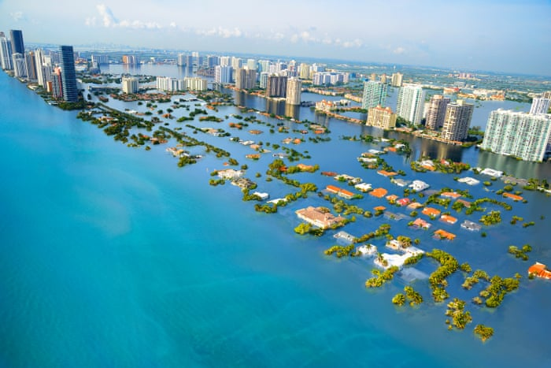
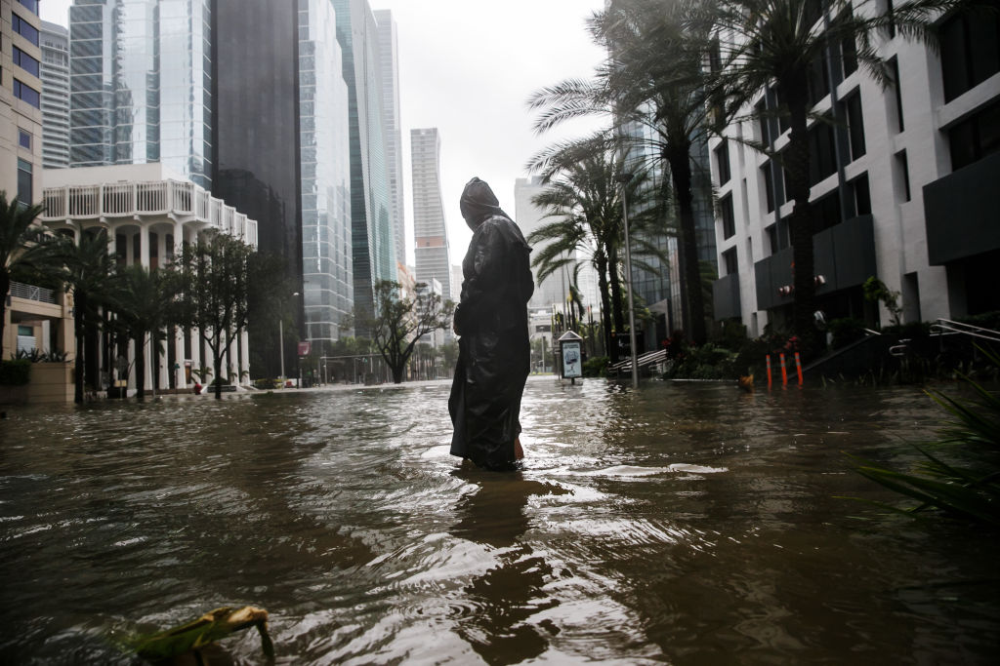
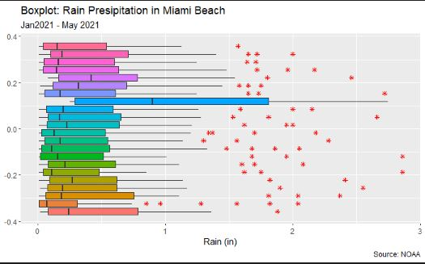
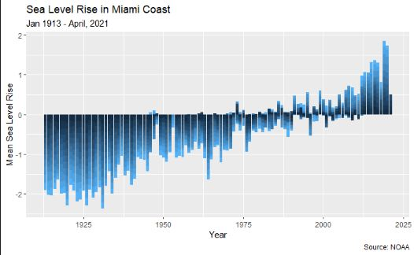

# Capstone
Climate Change Capstone Project

##**Problem Statement**

 > Miami Beach is a sink risk coastal community. Local officials work on strategies to reduce the risk of flooding due to increased sea levels [3]. The government hope to bring awareness of the dangers of flooding due to low terrain, extreme rainfall, annual real tides, and storms. The city investment in public infrastructure to mitigate the risk including rainfall, storms and sea levels rise with the best of science to do so [3].
  
>-The City of Miami beach is the economic lung for Miami Dade county. The tourism and the high cost for real states and the keep rise without thinking about the sinking problem ahead.  The effect will affect 13.1 million people and Miami-Dade and Broward Counties alone account for more than a quarter of this number of populations [4]. In 2015 the sea level rise is projected to be 6 to 10 inches by 2030 and 14 to 26 inches by 2060. The solution for this challenge is to evaluate the flow of the storm water drainage stations it can pump out the water bringing down flood waters from the city.

#**Climate Change Background**
>-The Earth’s climate has undergone continuous changes over the last half million years. According to NASA, there have been seven cycles of glacial eras, with the last ice age marking the start of the modern new climate era of human civilizations. These climate changes are the result of small alterations in the Earth’s orbit that change the quantity of solar light it receives. [1]
>-Rainfall incidents in the United States are increasing. All-time records for rainfall have surged recently intensifying flooding events. In the last century, global sea levels have risen by about 8 inches. However, the rate in the last two decades has been almost double that of the last century and has increased slightly each year. [2]
Miami Beach is a sink risk coastal community. Local officials work on strategies to reduce the risk of flooding due to increased sea levels. The government hope to bring awareness of the dangers of flooding due to low terrain, extreme rainfall, annual real tides, and storms. The city has invested in public infrastructure to mitigate the risk of rainfall, storms and sea levels rise with the best of science to do so. The public work is installing stormwater walls, creating higher elevations standards, and maintain the dune system.[3] The rise of sea levels caused by climate change presents a challenge for the water drainage system of the city. The City of Miami beach is the economic lung for Miami Dade county. The tourism and the high cost for real states and the keep rise without thinking about the sinking problem ahead.
>-According to NOAA, 2015 the sea level rise is projected to be 6 to 10 inches by 2030 and 14 to 26 inches by 2060. [4] The solution for this challenge is to evaluate the flow of the storm water drainage stations and how fast it can pump out the water to bring down flood waters from the city. The Flooding will affect 13.1 million people and Miami-Dade and Broward counties alone.
>-In the Fall 2017 South Florida has suffer major tides flooding called king tides. The tides are caused by the gravity of the moon which pulls the ocean towards it. Because of the Earth’s rotation, the moon is pulling the ocean in different directions, which causes high and low tides.[5]
Around 40 percent of USA population live near the coast. More than 600 million people in the world live within 10 meters of the sea level by 2000.[6] The property value in Miami Beach continues to increase despite the facts that houses, and high-rise buildings constructed near the beach are at a constant risk due to water level rising. [9]
The sea level was three inches higher in 2017 than the previous record in 1993.[5] One rare event for 2017 was La Niña that start late in the year and the event was barely weak. La Niña I the event that the water gets cold significantly reducing the volume of the water and the level of the sea drop. Some case that La Niña get strong the sea level drop below the average.[6]
>-The tides are accurately predictable for practical purpose, but the storm cause high tides that are not on the same prediction and contributes for flooding damages [7]. The Flood can be considered as a natural disaster that has caused damages in different cities. The characteristic of the population and their dimension cause more difficult to prepare the communities for the natural disaster [10].
>-The drainage systems on cities were designed for drain runoff waters from the streets and populates areas during the heavy rain event. The capacity for those drainage is not enough causing flooding impacting the urban with the economic loss. [8]
>-The purpose of this study is to analyze data to extract information for finding the best course of action to prevent flooding in Miami Beach. The data include rain precipitation, sea level rise and the flow of the storm water drainage station of Miami Beach.

#**Methodology**
>-This study pretends to cover the Miami Beach and coastal living zones. The summer in Miami is hot, wet and it rains frequently, usually from May to October, bringing heavy rainfall to the South peninsula. The heaviest rainfall month is September, and the driest month is January [11].
>-This study will focus on flooding caused by rain events in Miami Dade County and how it causes rise in the sea level. This study will analyze the causes using the flooding analysis areas that the precipitation event and the tidal levels. Previous studies compare multiple Machine Learning algorithms that have been used to calculate probabilistic coastal flood [12]. The Data obtained covers all urbanized regions from Miami Dade County including Aventura, Bal Harbor, Bay Harbor Island, Biscayne Park, Coral Gables, Cutler Bay, Miami Beach, Miami Downtown, Doral, Hialeah, Medley, Florida City, all 42 cities from Miami Dade County this is because the raw data belongs from different points. 
>-The variables that we are going to use for the analysis (rainfall, tide, vertical datum) were used in other studies [12],[14]. The data was obtained from the Miami Dade County Open Data Hub ( Florida, Miami-Dade County, MDC, County Government, https://gis-c.opendata.arcgis.com/search?tags=Environment), NOAA ( National Oceanic and Atmospheric Administration, Center for Operational Oceanographic product and Service). The variables were joined by day. We are going to split the data into the training (70%) and test (30%) for the respectively analysis. The variables were standardized from 0-1. Our initial proposal was to implement the k-nearest neighbor (kNN). The Sang study implements three ML algorithms: k nearest Neighbor (kNN), random forest (RF) and Support Vector Machine (SVM) [12].  The analysis for his study was best when the k was set to 5, so our project going to set the k to 5 using the kNN ML Algorithm because is the coastal flood risk analyses performed by Sang the result of KNN show the highest accuracy and reliability [12].
>-Upon executing the k-nearest neighbor (kNN) the model confronted problem related to the “too many ties in knn” error which prevented it from producing the desired result. The decision was to implement new methodology model. We moved to use a general linear model (GLM) as the Venderberg-Rodes study that he uses GLM to estimate the frequency of nuisance floods associated with the change in mean sea level [17].
Using the same parameter previously mentioned for the KNN, the data fit for the new model. The general linear model we specify the observation for the datum as flood or not-flood as a predictor variable and to contrast with precipitation and sea level. 

#Rain Presipitation in Miami Jan 2021 to May 2021
The following figures show how is the distribution of rain presipitation in Miami for the begining of the year 2021. The figure, show that the amount of rain presipitation is very low for the first half of the year2021.

#Sea LEvel Rise in Miami 
The following Figure show the sea level in Miami cost since 1913 to April 2021. We can observe that the sea level was very low until the begining of 80's. If we observe the figure very carefully, we can apreciate that the sea level increase very fast since the 90's century and the 2000 rise more fast.

#Result

**Linear Model Regression**
 At the Intercept in GLM the log-odds of survival for flood or not-flood (reference group) is -1.16.
For each of the other variables like precipitation (PRPC) and Sea Level (MSL), the coefficient tells us that the log-odds of survival for a PRCP is smaller than that of the reference group, and the MSL is higher with -0.91 and 0.61 respectively.
Given p<0.5, we can reject the null hypothesis (b1=0) that there is  difference in the log-odds between flood or not-flood. 
>-**Confusion Matrix**
	>-We can conclude that:
>- The Accuracy value of 54% means that identification that 137,540 of the total flood events is correct, and 117,229 is incorrect.
For the Precision value of 57% means that label of 179,270 of 254,769 of the total event is flood.
In terms of the Recall value is 40% means that 102799 of every 254,769 event, in reality, are missed by our model and 60% are correctly identified as a flood event.
Also the Specificity value is 46% means that 34,741of every 254,769flood event in reality are miss-labeled as flood.

